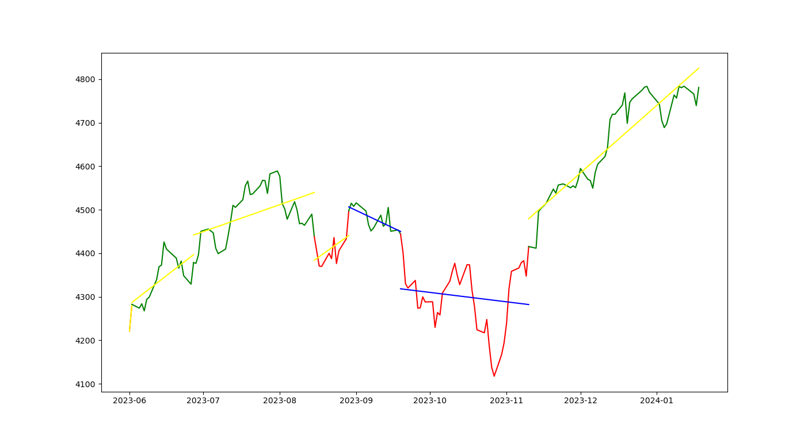

# Stock trending analysis with linear interpolation



Excute code script:

```bash
python linear_interpolate.py
```

### Find trending lines using linear interpolation
- Step 1: Calculate Exponentially Weighted Moving Average 'ema' from 'Close' price with `com = 200` to specify decay in terms of center of mass. In general, the 50- and 200-day EMAs are used as indicators for long-term trends, [[source](https://www.investopedia.com/terms/e/ema.asp)]. To know more about ewm function in python, visit [this document](https://pandas.pydata.org/pandas-docs/stable/reference/api/pandas.DataFrame.ewm.html). <br>

- Step 2: Calculate Percentage Change 'diff_pc' by `(data['Close'] / data['ema']) - 1`. In details, this is element-wise division between 'Close' and 'ema'.<br>

- Step 3: Defining [bull & bear](https://www.investopedia.com/insights/digging-deeper-bull-and-bear-markets/#:~:text=Key%20Takeaways,stocks%20are%20declining%20in%20value.) signal and return 'Signal' values. If 'diff_pc' > 0, this means 'increase' and return 1. If 'diff_pc' < 0, mean 'decrease' and return -1. If 'diff_pc' = 0, mean remain constant and return 0.<br>

- Step 4: Define how many consecutive signals are needed to change trend. In default, I set `min_signal = 2 `. The more 'min_signal', the longer fit lines to fit more data. From that it results in fewer linear lines and less accuracy.<br>

- Step 5: Find segments bounds. This means it finds the change in terms of signal values [-1,0,1] with change = True, remain = False.<br>

- Step 6: Find the start and end index of the plotted lines, the end index of this line is the start index of next line. However, there are many lines that just plotted on small points. Therefore, we keep only significant bounds. In this case, just keep bounds that have higher than 2 index. Make sure start index and end index are included. Just give a condition if first index != 0, we add 0 to first index; if last index != len(signal) - 1, add len(signal) - 1 to the last index.<br>

- Step 7: Get segments from given index (1 segment represents 1 line).<br>

- Step 8: Because we use [linear interpolation](https://matthew-brett.github.io/teaching/linear_interpolation.html), each segment is a straight line with form y = b + ax (a, b are what we try to find out) linked to each other. For each segment, apply linear regression to fit data points. Visit [this document](http://paulbourke.net/miscellaneous/interpolation/) for more details. To perform linear interpolation on data points, please [visit this](https://math.stackexchange.com/questions/177491/how-to-perform-simple-linear-interpolation-on-a-data-set).<br>

- Step 9: Figure out coefficient (a) of the linear function y = b + ax. This is also called slope of function.<br>

- Step 10: Choose slope threshold to determine whether the trending line tends to increase, decrease or keep stable. In this case, we should choose a very small value (approximate to 0).<br>
